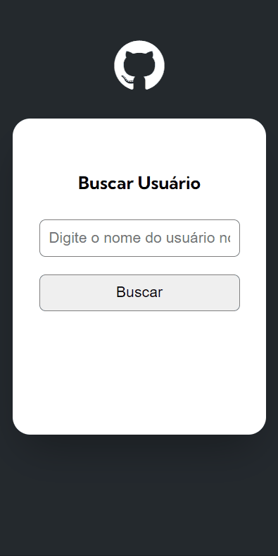
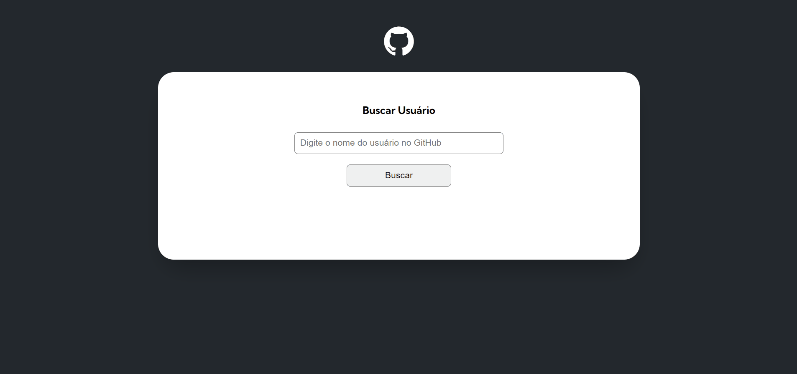

<h1 align="center">
   BUSCADOR DE USUÁRIOS GITHUB
</h1>

 

## 💻 Projeto

Projeto que consome a API do GitHub para apresentar os dados do usuário buscado. 

## 📷 Demonstração

  ### Mobile 📱  
  

   
  
  ### Desktop 💻
  

 

## 🚀 Tecnologias utilizadas:

✔️ JAVASCRIPT

✔️ HTML

✔️ CSS